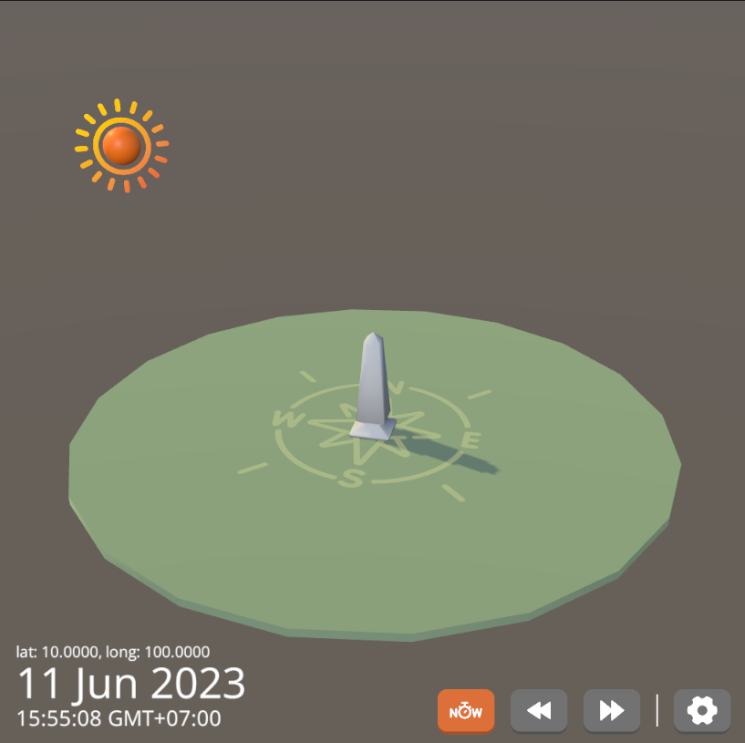

# Unity Sun Calculator

This project simulate position of the Sun based on the user's input location (latitude, longtitude), date and time.

## I. Overviews
Coming soon...

## II. Setups
Coming soon...

## III. Sample Scenes
Coming soon...

## IV. References
Coming soon...