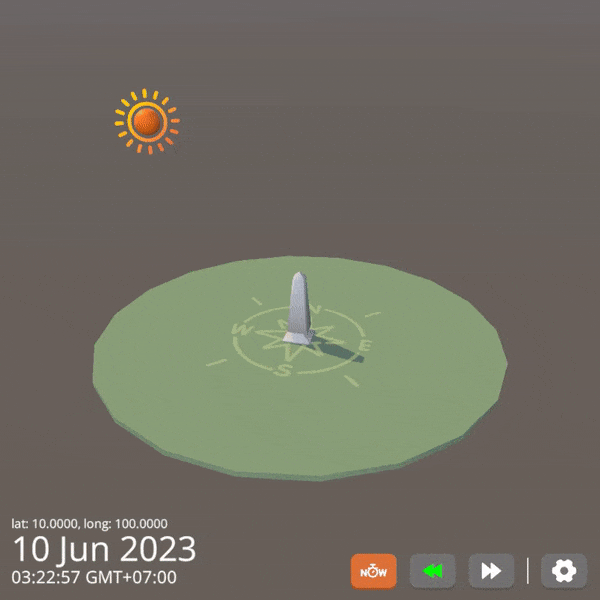
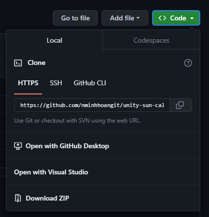
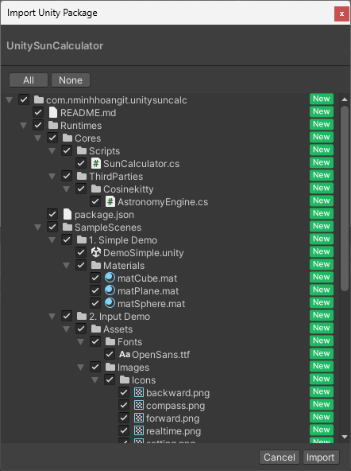
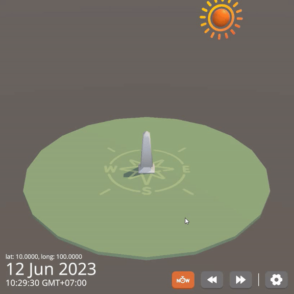
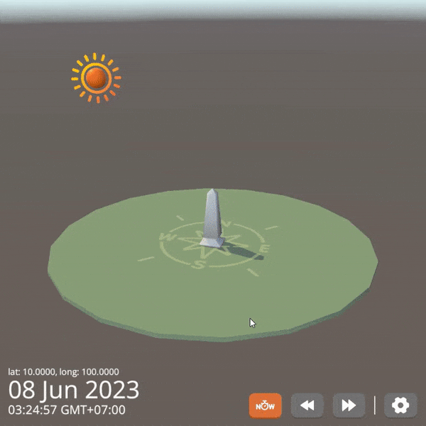
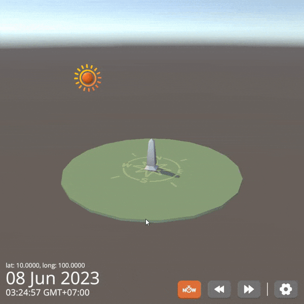
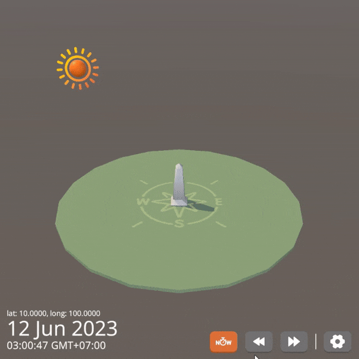
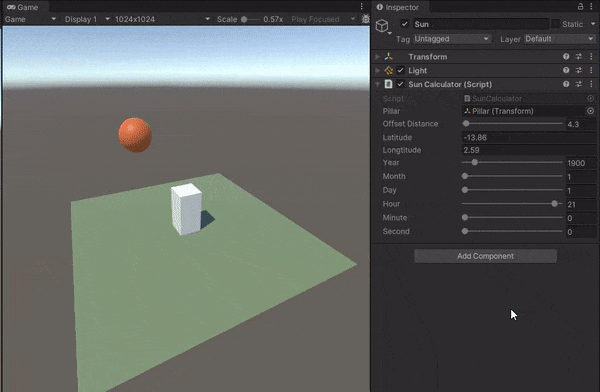

# Unity Sun Calculator
This repository contains the source code for simulate the position of the Sun based on the user's input location (`latitude`, `longitude`), `date` and `time`.

## Table of contents
* [Setups](#setups)
* [How To Use](#how-to-use)
* [Features](#features)
* [Sample Scenes](#sample-scenes)
* [References](#references)

## Setups

### Prerequisites
* **Unity Version**: This package is in development, and requires **Unity 2022.3**.
* **Render pipeline compatibility**: Built-in✅, URP✅, HDRP✅.

### How To Use

* You can clone this `repository` and run directly:
    * https://github.com/nminhhoangit/unity-sun-calculator

* Or import `Unity Custom Package` below into your own `Unity Project`'s folder:
    * [UnitySunCalculator.unitypackage](https://github.com/nminhhoangit/unity-sun-calculator/releases)

## Features
### Simulate Sun Position
Shows the movement of the Sun and sunlight-phase for a certain day at a certain place by using [Astronomy Engine Library](https://github.com/cosinekitty/astronomy/tree/master/source/csharp).

### User Input UI
Allow users to input latitude, longitude, current date (month/day), and time.

### Camera Rotation and Zooming 
Camera can be zoom by using middle mouse scroller (PC) or pinch two fingers (Mobile).

Camera can be rotation by drag/swipe on screen.

### Automatic Playback
Automatic playback of the date and time, moving it forward, backward.

## Sample Scenes
### Simple Demo Scene
This basic scene using `SunCalculator` attachted directly into the `Directional Light` to simulate Sun position based on provided datas such as `latitude`, `longitude`, `date` & `time`.
* Scene Path: `Assets/com.nminhhoangit.unitysuncalc/Runtimes/SampleScenes/1. Simple Demo/DemoSimple.unity`

### User Input Demo Scene
In this scene, the `DemoSunCalculatorScript` and `DemoSunCalculatorUIScript` are equipped with a user input interface, allowing users to provide input data. Then the input data passed to the SunCalculator for the purpose of presenting the position of the Sun.
* Scene Path: `Assets/com.nminhhoangit.unitysuncalc/Runtimes/SampleScenes/2. Input Demo/DemoSunCalcUserInput.unity`

 

## References
* [Astronomy Engine CSharp Library](https://github.com/cosinekitty/astronomy/tree/master/source/csharp)
* [SunCalc.org](https://www.suncalc.org)
* [Flaticon](https://https://www.flaticon.com)
* [Yughues Free Pillars & Columns](https://assetstore.unity.com/packages/3d/environments/yughues-free-pillars-columns-13103)
